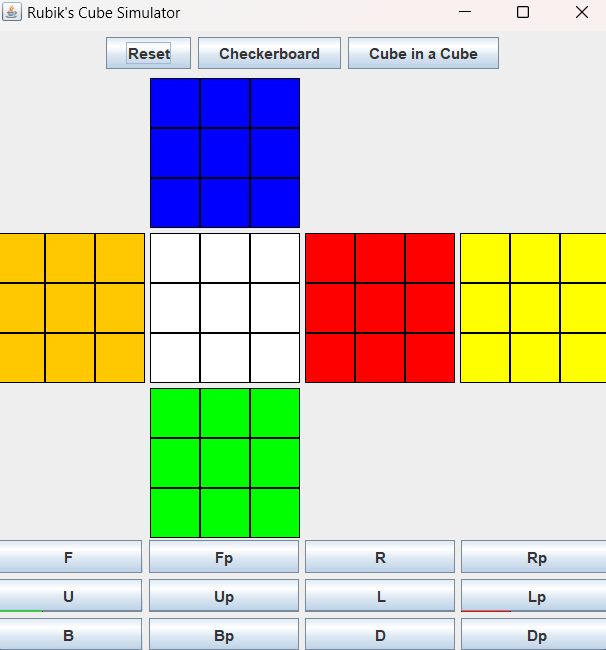

# Rubik's Cube Simulator 🧊

A **Rubik's Cube simulator** built using **Java AWT** and **Swing** libraries. This simulator visually represents a 3×3 cube and allows interaction through buttons that apply pre-defined patterns.

---

## 🛠 Technologies Used

- **Java AWT**: Used for layout management and handling low-level UI features such as drawing colored tiles and event handling.
- **Java Swing**: Used for building GUI components such as buttons, frames, and panels, offering a modern look and feel.

---

## 🎮 Features

### 1. **Reset Button**
- **Purpose**: Resets the cube back to its original **solved state**.
- Useful for starting a fresh simulation or resetting after any move pattern.

### 2. **Checkerboard Pattern Button**
- **Purpose**: Arranges the cube into a classic checkerboard pattern.
- **Sequence of moves** applied:  
  `F F B B L L R R U U D D`

### 3. **Cube in a Cube Pattern Button**
- **Purpose**: Applies a visually interesting "cube within a cube" pattern.
- **Sequence of moves** applied:  
  `F L F U R U F F L L U L' B D' B' L L U`

> **Note**: Standard Rubik's Cube notation is followed, where:
> - `F` = Front
> - `B` = Back
> - `L` = Left
> - `R` = Right
> - `U` = Up
> - `D` = Down  
> - `'` (e.g., `L'`) indicates a counter-clockwise (prime) turn

---

## 🖼️ Preview

### Initial Cube (Solved)


### Scrambled Cube using Moves via Buttons


### Checkerboard Pattern in Cube using Checkerboard Button


### Cube in a Cube Pattern in Cube using Cube in a Cube Button

## 🚀 Getting Started

### Prerequisites
- Java 8 or above installed

### How to Run
1. Clone the repository:
   ```bash
   git clone https://github.com/hridaysachdeva/Rubiks-Cube-Simulator.git
   ```
2. Navigate to the project directory and compile:
   ```bash
   javac com/RubiksCubeSimulator/*.java
   ```
3. Run the application:
   ```bash
   java com.RubiksCubeSimulator.RubiksCubeGUI
   ```

---


## 🤝 Contributing

Contributions, suggestions, and feedback are welcome! Feel free to open an issue or submit a pull request.

---
